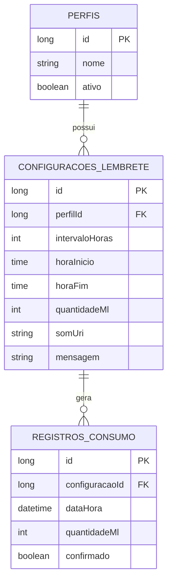

# Toma Água

App Android nativo (Kotlin + Jetpack Compose) para lembrar o usuário de beber água em horários e quantidades configuráveis, com suporte a múltiplos perfis de uso.

Projeto criado como portfólio e como exercício de revisão de fundamentos de Android, modelagem de dados e arquitetura MVVM.

---

## 1. Visão geral

O usuário configura, para cada **perfil** (ex: "Dia de trabalho", "Fim de semana", "Academia"):

- de quantas em quantas horas quer ser notificado (`intervaloHoras`);
- o período do dia em que essas notificações devem ocorrer (`horaInicio` → `horaFim`);
- a quantidade de água a beber por notificação (`quantidadeMl`);
- o som e a mensagem da notificação.

Apenas um perfil fica **ativo** por vez. Trocar de perfil reagenda automaticamente todos os lembretes com as novas configurações — por exemplo, ao sair de "Dia de trabalho" para "Fim de semana", os horários e a frequência mudam sem o usuário precisar reconfigurar nada manualmente.

## 2. Funcionamento inicial (fluxo do usuário)

1. Na primeira abertura, o app pede permissão de notificações (`POST_NOTIFICATIONS`, obrigatória a partir do Android 13) e, se necessário, a permissão de alarmes exatos (`SCHEDULE_EXACT_ALARM`, Android 12+).
2. O usuário cria seu primeiro **perfil** e define os parâmetros do lembrete no formulário de configuração.
3. Ao salvar, o app calcula os horários de disparo dentro do período definido (`horaInicio` até `horaFim`, respeitando `intervaloHoras`) e agenda um alarme exato para cada um via `AlarmManager`.
4. Nos horários calculados, um `BroadcastReceiver` recebe o alarme e dispara a notificação com a mensagem e o som configurados.
5. Se o dispositivo reiniciar, um receiver de `ACTION_BOOT_COMPLETED` relê o perfil ativo no banco local e reagenda todos os alarmes — alarmes do `AlarmManager` não sobrevivem a um reboot por padrão.
6. O usuário pode trocar de perfil a qualquer momento na tela de perfis; isso cancela os alarmes antigos e agenda os novos.

## 3. Arquitetura — MVVM

O projeto segue **Model-View-ViewModel**, com o fluxo de dados em uma única direção:

```
Room (dados) ──► Repository ──► ViewModel (StateFlow) ──► Composable (collectAsStateWithLifecycle)
                                        ▲
                                        │  eventos do usuário (onClick, onValueChange)
```
## 4. Modelo de dados



- **PERFIS**: contextos de uso do usuário (trabalho, fim de semana, academia...). Apenas um tem `ativo = true`.
- **CONFIGURACOES_LEMBRETE**: parâmetros de notificação de cada perfil. `ForeignKey` com `onDelete = CASCADE` — apagar um perfil remove suas configurações automaticamente.
- **REGISTROS_CONSUMO**: histórico de cada lembrete disparado/confirmado. Não é essencial para o MVP, mas viabiliza uma tela futura de estatísticas de consumo diário.

## 5. Agendamento de notificações

Decisão arquitetural central do projeto: **`AlarmManager` + `BroadcastReceiver`**, não `WorkManager`.

`AlarmManager.setExactAndAllowWhileIdle()` (dispara mesmo em Doze Mode) + um `BroadcastReceiver` que constrói a notificação ao receber o alarme.

Pontos tratados no projeto:
- **Permissão de alarmes exatos** (Android 12+): checagem de `canScheduleExactAlarms()` antes de agendar.
- **Reboot do aparelho**: alarmes não sobrevivem a reinicialização — um receiver de `ACTION_BOOT_COMPLETED` relê o perfil ativo e reagenda tudo.
- **Canal de notificação por som**: a partir do Android 8, som e importância de uma notificação são fixados no `NotificationChannel` no momento da criação e não podem ser alterados depois via código. Por isso o app cria um canal por combinação de som (`lembrete_agua_<somId>`), em vez de um canal único.
- **Permissão de notificações** (Android 13+): solicitação em runtime de `POST_NOTIFICATIONS`.

## 6. Estrutura de pacotes

```
com.example.lembreteagua/
├── data/
│   ├── local/          # Entities, DAOs e banco Room
│   ├── repository/     # Implementações de Repository
│   └── alarm/          # Agendamento (AlarmManager) e BroadcastReceivers
├── domain/
│   └── model/          # Modelos de domínio e casos de uso (se necessário)
├── ui/
│   ├── home/            # HomeScreen + HomeViewModel
│   ├── perfis/          # PerfilListScreen + PerfilListViewModel
│   ├── configuracao/    # ConfiguracaoEditorScreen + ConfiguracaoEditorViewModel
│   └── components/      # Composables reutilizáveis
└── di/                  # Módulos Hilt
```

## 7. Tecnologias

| Camada | Tecnologia |
|---|---|
| UI | Jetpack Compose, Material 3 |
| Arquitetura | MVVM, StateFlow, ViewModel |
| Persistência | Room |
| Agendamento | AlarmManager, BroadcastReceiver |
| Injeção de dependência | Hilt |
| Assincronia | Kotlin Coroutines / Flow |

## 8. Roadmap

- [ ] CRUD de perfis e configurações (Room + Repository)
- [ ] Agendamento de alarmes por perfil ativo
- [ ] Notificações com som e mensagem personalizados
- [ ] Reagendamento após reboot
- [ ] Tela de histórico/estatísticas de consumo (`RegistroConsumo`)
- [ ] Testes unitários dos ViewModels
